# DeskLink — Remote Desktop Platform Architecture

> **Codename:** DeskLink
> **Goal:** Build a production-grade, cross-platform remote desktop solution that is simpler and more accessible than AnyDesk for non-technical users.

---

# Phase 2: Core P2P — Implementation Plan

This plan details the implementation of Phase 2, focusing on establishing the core WebRTC peer-to-peer connection, capturing the screen on Windows, and injecting remote input.

## User Review Required

> [!IMPORTANT]
> **WebRTC Rust Stack:** Implementing WebRTC natively in Rust (for the host agent) is complex. I propose using the `webrtc-rs` crate (a pure Rust implementation of WebRTC). Alternatively, we could use the Chromium embedded framework (CEF) or a hidden Tauri WebView on the host to handle WebRTC via JavaScript, which is much easier but uses more RAM. **Decision:** I will proceed with a hidden Tauri WebView on the host for WebRTC handling to ensure rapid, stable delivery for MVP, unless you prefer the pure Rust `webrtc-rs` approach.

> [!WARNING]
> **Docker Dependency:** The signaling server requires Redis to run. Since Docker is not running on your machine, I will mock the Redis dependency in the signaling server during this phase (using an in-memory map instead of `ioredis`) so we can test the P2P connection locally without needing Docker.

## Open Questions

1. **Host Agent UI:** Should the host agent have a full window UI to show settings, or just a system tray icon with a right-click menu? (I will default to a simple system tray icon for now).
2. **Screen Capture Performance:** DXGI Desktop Duplication on Windows can be heavy. If it fails or lags on your specific hardware, should I implement a simpler fallback (like GDI capture) in this phase?

## Proposed Changes

### WebRTC Browser-to-Browser POC

To isolate WebRTC issues from Rust issues, we will first build a browser-to-browser test mode.
#### [MODIFY] packages/client-ui/src/hooks/useWebRTC.ts
- Implement the `RTCPeerConnection` lifecycle.
- Handle SDP offers/answers and ICE candidates via the signaling server.
- Manage `MediaStream` (video) and `RTCDataChannel` (input/control).
#### [MODIFY] packages/client-ui/src/components/RemoteViewport.tsx
- Connect the `<video>` element to the WebRTC `MediaStream`.
- Capture mouse and keyboard events and send them via `RTCDataChannel`.

### Signaling Server Adjustments (Docker-less Dev)

#### [MODIFY] packages/signaling-server/src/redis/adapter.ts
- Implement an in-memory fallback when `REDIS_URL` is not provided or fails to connect, allowing local testing without Docker.

### Tauri Host Agent (Windows)

#### [NEW] apps/host-agent/src-tauri/Cargo.toml & tauri.conf.json
- Initialize the Tauri v2 project for the host agent.
- Configure it as a background app with a system tray icon.
#### [NEW] apps/host-agent/src-tauri/src/capture/windows.rs
- Implement Windows screen capture using the `windows` crate (DXGI Desktop Duplication API).
- Stream frames to the hidden Tauri WebView.
#### [NEW] apps/host-agent/src-tauri/src/input/windows.rs
- Implement remote input injection using the `windows` crate (`SendInput` API).
- Listen to commands from the hidden WebView (received via WebRTC DataChannel) and execute them on the OS.
#### [NEW] apps/host-agent/src/WebRTCHost.tsx
- The hidden React component running inside the host agent's WebView.
- Handles the WebRTC connection, receives input commands via DataChannel (forwarding to Rust via Tauri IPC), and sends the video stream (captured by Rust) to the client.

## Verification Plan

### Automated Tests
- Unit tests for the `useWebRTC` hook logic.
- Unit tests for the in-memory Redis fallback in the signaling server.

### Manual Verification
1. **Browser POC:** Open two browser windows (Client A and Client B). Client A connects to Client B. Client B shares its screen (via browser prompt). Client A sees the screen and sends input events (logged to console).
2. **Host Agent:** Run the `host-agent` Tauri app on Windows. Connect from the `client-ui` in the browser. Verify the Windows screen is visible in the browser and that clicking/typing in the browser controls the Windows host.

---

## 0. Design Review — Multi-Specialist Analysis

Before presenting the architecture, here is the condensed output of the design review conducted from every specialist perspective. Each specialist challenged the initial design; the architecture below reflects all accepted improvements.

| Specialist | Key Concern Raised | Resolution |
|---|---|---|
| **Principal Architect** | Monolith signaling server will bottleneck at scale | Adopted stateless signaling microservice behind a load balancer; session state in Redis |
| **Distributed Systems** | Split-brain during reconnects if two relays claim the same session | Introduced distributed lock via Redis `SET NX` with TTL on session ownership |
| **Enterprise Solutions** | No multi-tenant / org-level management | Added `organizations` and `org_memberships` to schema; scoped device visibility |
| **Sr. Backend Engineer** | REST for signaling is too slow for real-time negotiation | WebSocket for signaling; REST only for device registration, auth, and admin APIs |
| **Sr. Frontend Engineer** | Electron is heavy for a simple client | Agreed — use **Tauri v2** (Rust core + web UI) for drastically smaller binaries (~15 MB vs ~150 MB) |
| **Sr. WebRTC Engineer** | Data channel alone can't carry screen video efficiently | Use `MediaStream` track for video, `RTCDataChannel` for input events and file transfer |
| **Network Engineer** | Symmetric NAT in corporate networks defeats STUN | Mandatory TURN server deployment; STUN is attempted first, TURN is automatic fallback |
| **Security Architect** | Plain passcode is vulnerable to brute-force | Passcodes are 6-digit, rate-limited (5 attempts/min), expire in 10 min, and are PBKDF2-hashed |
| **Cryptography Engineer** | Relying solely on DTLS-SRTP for E2E encryption | Added an application-layer E2E key exchange (X25519 + HKDF) for zero-knowledge signaling |
| **Desktop Systems** | Screen capture permission flow differs wildly across OS | Abstracted via a platform trait: `ScreenCapture` with Windows (DXGI) and macOS (ScreenCaptureKit) impls |
| **Windows Platform** | UAC elevation for remote input injection | Host agent runs as a Windows Service for input injection; UI tray app communicates via named pipe |
| **macOS Platform** | Accessibility & screen recording permissions required | First-launch wizard guides user through System Settings → Privacy; agent verifies grants on startup |
| **DevOps Engineer** | How to push updates to host agents in the field? | Built-in auto-updater with differential binary patches, signed with Ed25519 |
| **Cloud Architect** | TURN servers are bandwidth-expensive | Deploy TURN only in 3 regions initially; use coturn with bandwidth quotas per session |
| **SRE** | No observability into P2P sessions | Agent and client emit OpenTelemetry traces + Prometheus metrics; central Grafana dashboards |
| **Database Architect** | Session logs at scale will bloat Postgres | Hot session data in Postgres (30 days), cold data archived to S3-backed Parquet via nightly job |
| **UI/UX Designer** | AnyDesk's UI is confusing for non-tech users | Single "Connect" screen with large input field; connection status as a simple traffic-light indicator |
| **Accessibility Specialist** | Remote desktop UIs typically fail WCAG | All client UI meets WCAG 2.1 AA; keyboard-navigable, screen-reader labels on all controls |
| **Technical PM** | Scope creep risk with AI diagnostics | AI diagnostics is Phase 5; MVP ships without it; well-defined API boundary for later integration |
| **Startup Founder** | Time to first connection must be < 60 seconds from install | Installer auto-generates Device ID, starts agent, and shows passcode — zero config |

---

## 1. High-Level Architecture

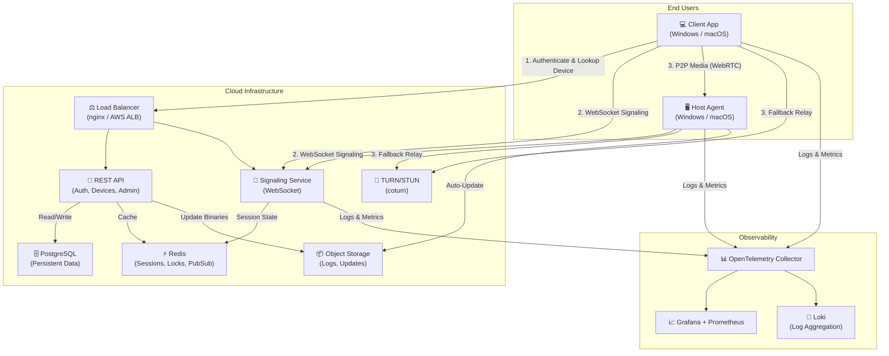

### Connection Flow (Sequence)

```mermaid
sequenceDiagram
    participant Host as Host Agent
    participant SS as Signaling Server
    participant Client as Client App
    participant TURN as TURN Server

    Host->>SS: 1. Register (Device ID, public key)
    Host->>SS: 2. Maintain persistent WebSocket

    Client->>SS: 3. Connect request (target Device ID + passcode hash)
    SS->>Host: 4. Forward connection request
    Host->>SS: 5. Verify passcode → Accept/Reject
    SS->>Client: 6. Connection accepted + Host's public key

    Note over Client,Host: E2E Key Exchange (X25519)
    Client->>Host: 7. SDP Offer (via signaling, encrypted envelope)
    Host->>Client: 8. SDP Answer
    Client->>Host: 9. ICE Candidates
    Host->>Client: 10. ICE Candidates

    alt Direct P2P Possible
        Client<->Host: 11a. Direct DTLS-SRTP Media
    else NAT Traversal Fails
        Client->>TURN: 11b. TURN Allocation
        Host->>TURN: 11b. TURN Allocation
        Client<->Host: 11c. Relayed Media via TURN
    end

    Note over Client,Host: Session Active
    Client->>Host: Input events (DataChannel)
    Host->>Client: Screen frames (MediaStream)
```

### Design Decisions

| Decision | Rationale |
|---|---|
| **WebSocket signaling** (not REST long-poll) | Sub-100ms connection setup; bidirectional for ICE trickle |
| **Redis for session state** | Signaling servers are stateless and horizontally scalable; Redis provides shared session state + pub/sub for multi-instance coordination |
| **PostgreSQL for persistence** | ACID compliance for user accounts, devices, audit logs; JSONB for flexible metadata |
| **coturn for TURN** | Open-source, battle-tested, supports TURNS (TLS), bandwidth quotas |
| **Tauri v2 for client** | 10x smaller binary than Electron; native OS integration via Rust; web UI for rapid iteration |
| **Device ID, not account-first** | AnyDesk-like UX — install and go; optional account for management features |

---

## 2. Component Breakdown

### 2.1 Cloud Services

| Component | Technology | Responsibility |
|---|---|---|
| **Signaling Service** | Node.js (TypeScript) + `ws` library | WebSocket management, SDP/ICE relay, session orchestration |
| **REST API** | Node.js (TypeScript) + Fastify | Authentication, device registration, org management, admin |
| **Redis** | Redis 7+ with Cluster mode | Session state, distributed locks, pub/sub for signaling fan-out |
| **PostgreSQL** | PostgreSQL 16 | Users, devices, organizations, session logs, audit trail |
| **TURN/STUN** | coturn | NAT traversal relay; STUN for reflexive address discovery |
| **Object Storage** | S3 / GCS | Session recordings, agent update binaries, archived logs |
| **Update Service** | Rust microservice | Binary diff generation, Ed25519 signing, update manifest serving |

### 2.2 Host Agent

| Component | Technology | Responsibility |
|---|---|---|
| **Core Service** | Rust | Main daemon; lifecycle, signaling, WebRTC, input injection |
| **Screen Capture** | Rust (DXGI on Win, ScreenCaptureKit on macOS) | Frame capture → H.264/VP9 encoding |
| **Input Injector** | Rust (Win32 `SendInput` / macOS `CGEvent`) | Translate remote mouse/keyboard events to OS-level events |
| **Tray UI** | Tauri (web view) | Show Device ID, passcode, connection status, settings |
| **Auto-Updater** | Rust | Check for updates, download delta patches, verify Ed25519, self-replace |

### 2.3 Client App

| Component | Technology | Responsibility |
|---|---|---|
| **Shell** | Tauri v2 (Rust + TypeScript) | Native window, menu bar, system integration |
| **UI Layer** | React + TypeScript | Connection screen, remote viewport, settings, session history |
| **WebRTC Manager** | TypeScript (`RTCPeerConnection`) | Peer connection lifecycle, ICE handling, media track management |
| **Input Capture** | TypeScript + Rust (Tauri commands) | Capture mouse/keyboard, normalize, send via DataChannel |
| **Reconnect Engine** | TypeScript | Exponential backoff, ICE restart, session resumption |

---

## 3. Database Schema

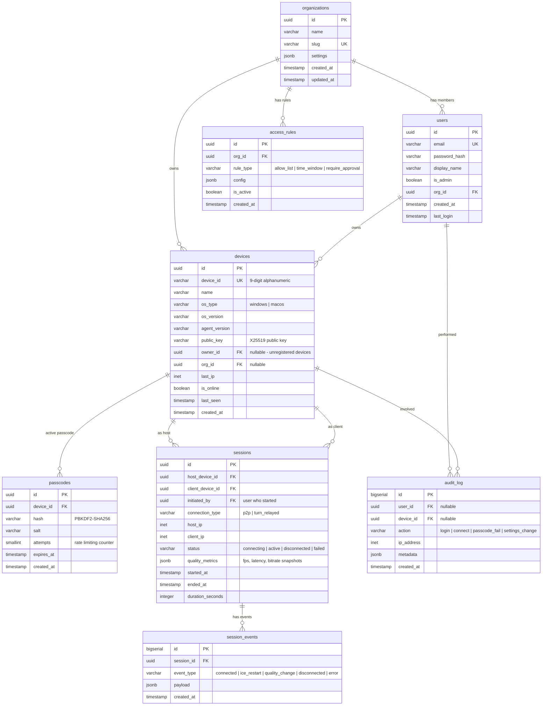

### Schema Design Decisions

| Decision | Rationale |
|---|---|
| **`device_id` is a 9-char alphanumeric string** | Easy to read aloud over phone ("DL-ABC-12X-9Z"); collision-resistant at scale |
| **`passcodes` is a separate table** | Passcodes rotate independently; old ones are soft-deleted for audit; supports multiple active passcodes (e.g., one-time vs. persistent) |
| **`session_events` as an append-only log** | Enables replay of session lifecycle; critical for diagnostics and SRE troubleshooting |
| **`quality_metrics` as JSONB** | Schema-flexible; metrics evolve faster than the table structure |
| **`access_rules` with JSONB config** | Supports diverse rule types (IP allowlists, time windows, approval workflows) without schema explosion |
| **Nullable `owner_id` on devices** | Unregistered devices (install-and-go mode) don't require an account; can be claimed later |

### Indexing Strategy

```sql
-- Hot-path queries
CREATE INDEX idx_devices_device_id ON devices (device_id);
CREATE INDEX idx_devices_online ON devices (is_online) WHERE is_online = true;
CREATE INDEX idx_sessions_active ON sessions (status) WHERE status IN ('connecting', 'active');
CREATE INDEX idx_sessions_host ON sessions (host_device_id, started_at DESC);
CREATE INDEX idx_passcodes_device ON passcodes (device_id, expires_at) WHERE expires_at > NOW();
CREATE INDEX idx_audit_log_device ON audit_log (device_id, created_at DESC);

-- Partitioning for session_events (by month)
-- session_events is range-partitioned on created_at for efficient archival
```

---

## 4. WebRTC Architecture

### 4.1 Peer Connection Topology

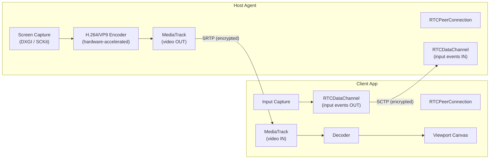

### 4.2 Channel Design

| Channel | Transport | Purpose | Reliability |
|---|---|---|---|
| **Video** | `MediaStreamTrack` (VP9/H.264) | Screen frames | Unreliable (UDP); quality adaptive |
| **Input** | `RTCDataChannel` ("input") | Mouse moves, clicks, key events | Reliable, ordered |
| **Control** | `RTCDataChannel` ("control") | Clipboard sync, session control msgs | Reliable, ordered |
| **File Transfer** | `RTCDataChannel` ("files") | Drag-and-drop file transfer | Reliable, ordered; chunked |
| **Telemetry** | `RTCDataChannel` ("telemetry") | Latency probes, quality reports | Unreliable; periodic |

### 4.3 Codec & Quality Strategy

```
Bandwidth Tiers:
  ┌─────────────────────────────────────────────────────┐
  │  > 5 Mbps   →  1080p @ 30fps, VP9, high quality    │
  │  2-5 Mbps   →  720p @ 24fps, VP9, medium quality   │
  │  0.5-2 Mbps →  480p @ 15fps, H.264, low quality    │
  │  < 0.5 Mbps →  360p @ 10fps, H.264, reduced color  │
  └─────────────────────────────────────────────────────┘

Adaptation: Sender-side bandwidth estimation (GCC algorithm built into WebRTC).
Keyframe: On-demand when quality drops or after ICE restart.
```

### 4.4 NAT Traversal Strategy

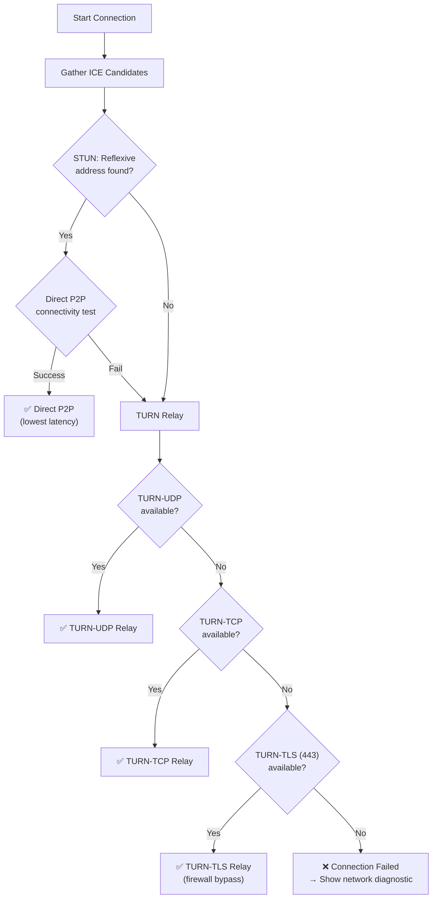

> **Key Decision:** TURN-TLS on port 443 is the last-resort fallback. It disguises traffic as HTTPS, bypassing even the most restrictive corporate firewalls. This is critical for the "Office Network Access Mode."

### 4.5 ICE Restart & Auto-Reconnect

```
Reconnection State Machine:
  ┌──────────┐     ICE failed      ┌──────────────┐
  │ Connected ├────────────────────►│ ICE Restart   │
  └──────────┘                     │ (same session) │
       ▲                           └───────┬────────┘
       │                                   │
       │    Success                        │ Fail (3 attempts)
       ├───────────────────────────────────┘
       │                           ┌──────────────┐
       │                           │ Full Reconnect │
       │    Success                │ (new session)  │
       ├───────────────────────────┤               │
       │                           └───────┬────────┘
       │                                   │ Fail (3 attempts)
       │                           ┌──────────────┐
       └───────────────────────────│ Disconnected  │
                                   │ (notify user)  │
                                   └──────────────┘

Backoff: 1s → 2s → 4s (ICE restart), 2s → 5s → 15s (full reconnect)
```

---

## 5. Host Agent Architecture

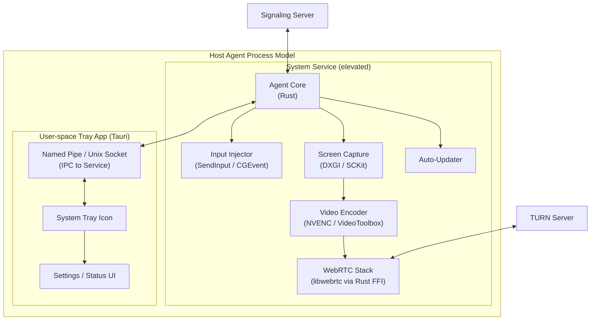

### 5.1 Platform Abstraction Layer

```
trait ScreenCapture {
    fn start(&mut self, config: CaptureConfig) -> Result<FrameStream>;
    fn stop(&mut self);
    fn list_displays() -> Vec<DisplayInfo>;
}

trait InputInjector {
    fn inject_mouse_move(x: i32, y: i32);
    fn inject_mouse_click(button: MouseButton, action: ClickAction);
    fn inject_key(key: KeyCode, modifiers: Modifiers, action: KeyAction);
    fn inject_scroll(dx: f64, dy: f64);
}

trait PlatformPermissions {
    fn check_permissions() -> PermissionStatus;
    fn request_permissions() -> Result<()>;
}
```

| Platform | Screen Capture | Input Injection | Encoder | Service Model |
|---|---|---|---|---|
| **Windows** | DXGI Desktop Duplication API | `SendInput` (Win32) | NVENC (GPU) / OpenH264 (CPU) | Windows Service (`sc.exe`) |
| **macOS** | `ScreenCaptureKit` (macOS 12.3+) | `CGEvent` (Quartz) | VideoToolbox (Apple Silicon) | `launchd` daemon |

### 5.2 Passcode Management

```
Passcode Lifecycle:
  ┌─────────────┐     Install/Startup     ┌──────────────────┐
  │ Agent Start  ├───────────────────────►│ Generate Passcode │
  └─────────────┘                         │  (6-digit, crypto │
                                          │   random)         │
                                          └────────┬─────────┘
                                                   │
                                          ┌────────▼─────────┐
                                          │ Hash (PBKDF2) &   │
                                          │ Store locally +   │
                                          │ Register w/ server│
                                          └────────┬─────────┘
                                                   │
                                          ┌────────▼─────────┐
                                          │ Display in Tray   │
                                          │ UI (plaintext,    │
                                          │ local only)       │
                                          └────────┬─────────┘
                                                   │
                                     ┌─────────────▼──────────────┐
                                     │ Expires after 10 min OR    │
                                     │ after successful connection│
                                     │ → Auto-rotate new passcode │
                                     └────────────────────────────┘
```

### 5.3 Office Network Access Mode

This mode enables connecting to office machines without the remote user needing to interact with the host:

1. **Admin sets a persistent access password** (not a rotating passcode) via org settings.
2. **Access rules** define who can connect (by user ID or IP range) and when (time windows).
3. **Wake-on-LAN** integration sends a magic packet to wake sleeping office machines.
4. **Unattended access** — agent accepts connections matching access rules without user confirmation.
5. **Audit trail** — every unattended connection is logged with full metadata.

---

## 6. Client Architecture

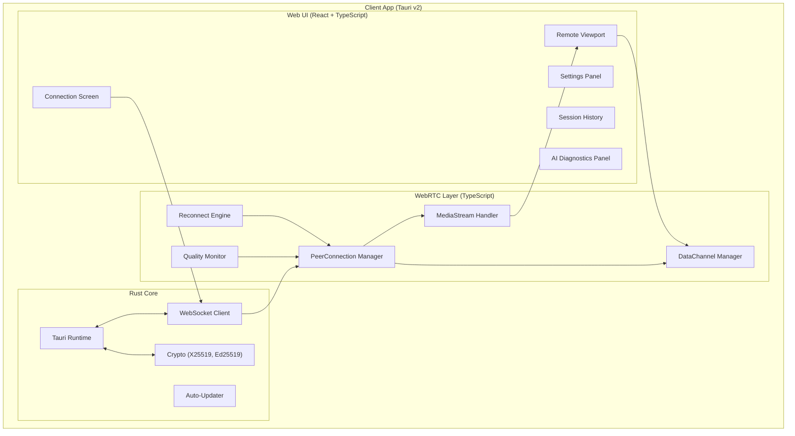

### 6.1 UI/UX Design Principles

> **Design Philosophy:** "If your grandparent can't connect in under 60 seconds, the design has failed."

```
┌─────────────────────────────────────────────────────────┐
│  DeskLink                                    ─  □  ✕   │
├─────────────────────────────────────────────────────────┤
│                                                         │
│   Your Device ID:  DL-7K2-MN9-4X                       │
│   ● Online                                              │
│                                                         │
│   ┌─────────────────────────────────────────────────┐   │
│   │                                                 │   │
│   │     Enter Remote Device ID                      │   │
│   │     ┌───────────────────────────────────────┐   │   │
│   │     │  DL-___-___-__                        │   │   │
│   │     └───────────────────────────────────────┘   │   │
│   │                                                 │   │
│   │     ┌───────────────────────┐                   │   │
│   │     │     🔗  Connect       │                   │   │
│   │     └───────────────────────┘                   │   │
│   │                                                 │   │
│   └─────────────────────────────────────────────────┘   │
│                                                         │
│   Recent Connections                                    │
│   ┌─────────────────────────────────────────────────┐   │
│   │  🖥  Office Desktop     DL-AB3-..  2 min ago    │   │
│   │  🖥  Mom's Laptop       DL-QW8-..  Yesterday    │   │
│   └─────────────────────────────────────────────────┘   │
│                                                         │
└─────────────────────────────────────────────────────────┘
```

### 6.2 Remote Viewport Features

| Feature | Implementation |
|---|---|
| **Adaptive scaling** | Canvas scales to fit window; 1:1 pixel mode toggle |
| **Multi-monitor** | Host sends display list; client can switch or view all |
| **Cursor rendering** | Host sends cursor shape/position; client renders overlay cursor for zero-latency feel |
| **Clipboard sync** | Bidirectional via DataChannel; text and images |
| **Keyboard mapping** | Normalize keycodes across platforms (USB HID standard internally) |
| **Session toolbar** | Floating toolbar: fullscreen, Ctrl+Alt+Del (Windows), display switcher, disconnect |

---

## 7. Security Architecture

### 7.1 Threat Model

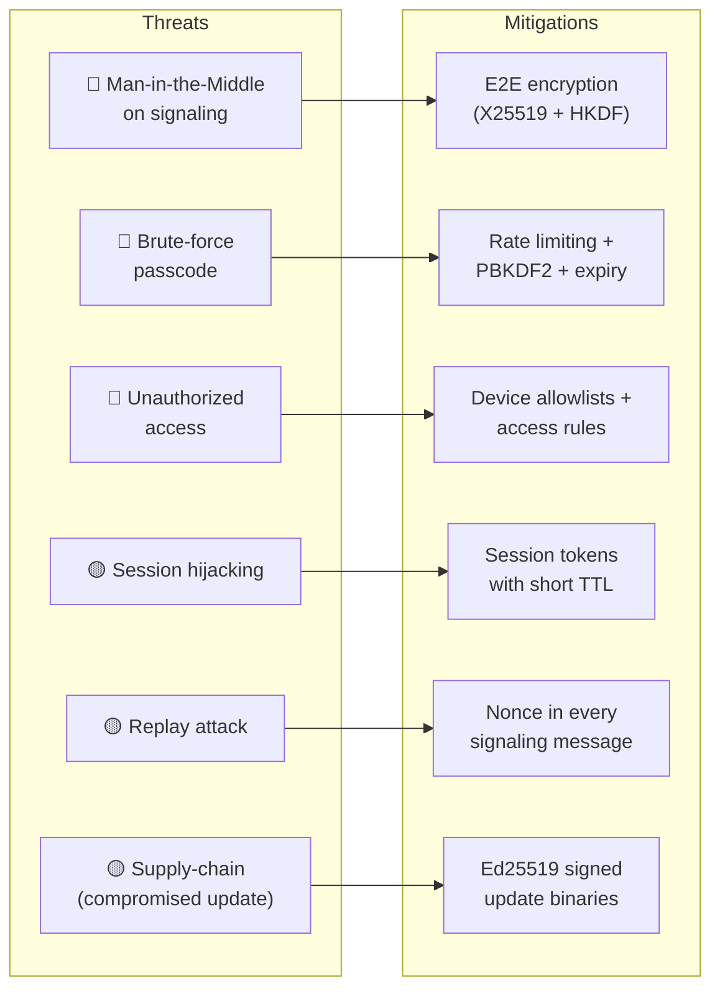

### 7.2 Encryption Layers

```
Layer 1: Transport Security
  ├── Client ↔ Signaling Server: TLS 1.3 (WSS)
  ├── Host ↔ Signaling Server: TLS 1.3 (WSS)
  └── Client ↔ TURN Server: TURNS (DTLS)

Layer 2: WebRTC Media Security
  ├── DTLS-SRTP for media streams (automatic via WebRTC)
  └── DTLS for DataChannels (automatic via WebRTC)

Layer 3: Application-Layer E2E Encryption
  ├── Key Exchange: X25519 Diffie-Hellman
  ├── Key Derivation: HKDF-SHA256
  ├── SDP Encryption: AES-256-GCM (prevents signaling server from reading SDP)
  └── Verification: Both parties can compare key fingerprint (optional, for paranoid users)
```

> **Why 3 layers?** The signaling server is a trusted relay, but we treat it as a potential adversary. Layer 3 ensures that even a compromised signaling server cannot decrypt the SDP offer/answer, which contains DTLS fingerprints. Without this, a MitM on the signaling server could substitute DTLS fingerprints and intercept the media.

### 7.3 Authentication Flow

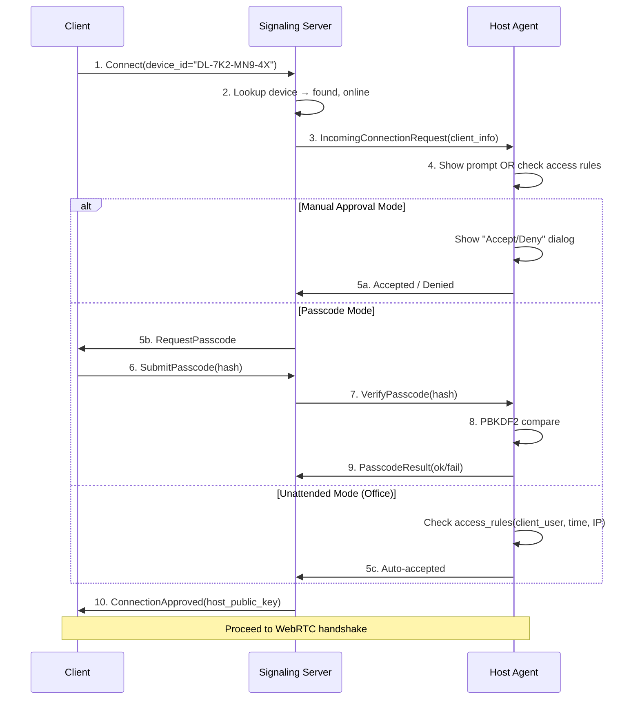

### 7.4 Security Policies

| Policy | Implementation |
|---|---|
| **Passcode brute-force protection** | Max 5 attempts per 60 seconds; lockout after 15 failed attempts (30 min cooldown) |
| **Session timeout** | Idle sessions auto-disconnect after 30 min (configurable) |
| **Forced passcode rotation** | New passcode every 10 minutes; on every successful connection |
| **Audit logging** | All auth attempts, connections, disconnections, and admin actions |
| **Binary signing** | All agent/client binaries and updates signed with Ed25519 |
| **CSP headers** | Strict Content-Security-Policy on all web UI content |
| **Secrets storage** | Passcode hashes in OS keychain (Windows Credential Manager / macOS Keychain) |

---

## 8. Deployment Architecture

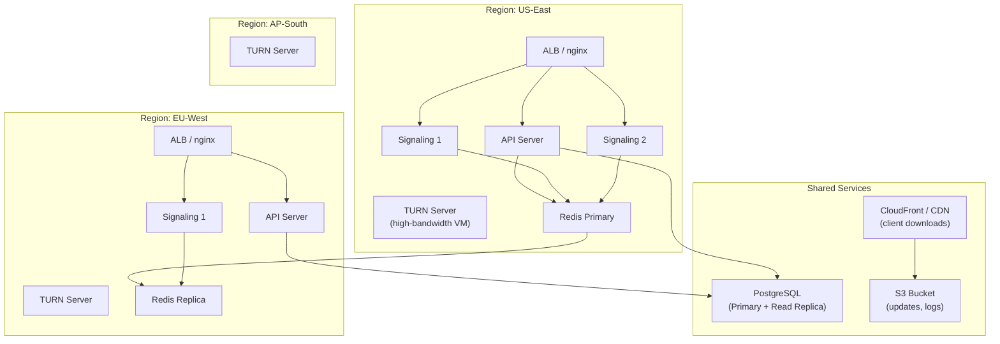

### 8.1 Infrastructure Specifications

| Component | Spec | Count | Scaling |
|---|---|---|---|
| **Signaling Server** | 2 vCPU, 4 GB RAM | 2 per region | Horizontal (stateless); add instances behind LB |
| **API Server** | 2 vCPU, 4 GB RAM | 1 per region | Horizontal; stateless |
| **TURN Server** | 4 vCPU, 8 GB RAM, **high-bandwidth NIC** | 1 per region (3 total) | Vertical first, then add servers |
| **Redis** | 2 vCPU, 8 GB RAM | 1 primary + 1 replica | Redis Cluster for >10K concurrent sessions |
| **PostgreSQL** | 4 vCPU, 16 GB RAM, SSD | 1 primary + 1 read replica | Vertical; partitioning for session_events |
| **S3** | — | 1 bucket | Unlimited |

### 8.2 CI/CD Pipeline

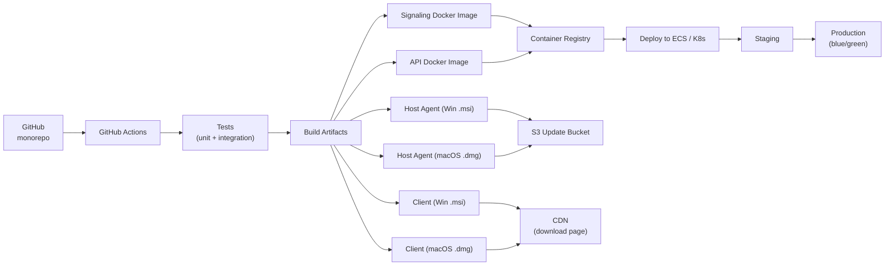

### 8.3 Container Strategy

```dockerfile
# Signaling & API servers: multi-stage Docker build
# Base: node:20-alpine (minimal attack surface)
# Final image: ~50 MB
# Health check: /health endpoint
# Graceful shutdown: drain WebSocket connections on SIGTERM
```

### 8.4 TURN Server Deployment

> **Critical Note:** TURN servers are **not containerized**. They run on dedicated VMs with:
> - Public IP (no NAT)
> - High-bandwidth NIC (1 Gbps+)
> - Bandwidth quotas: 100 MB per session, 1 TB per server per day
> - `coturn` config with `--no-multicast-peers`, `--denied-peer-ip` for security

---

## 9. Folder Structure (Monorepo)

```
desklink/
├── .github/
│   ├── workflows/
│   │   ├── ci.yml                    # Lint, test, build on PR
│   │   ├── release-server.yml        # Deploy signaling + API
│   │   ├── release-desktop.yml       # Build + sign desktop apps
│   │   └── release-turn.yml          # TURN server config deploy
│   └── CODEOWNERS
│
├── packages/
│   ├── common/                       # Shared TypeScript types & utilities
│   │   ├── src/
│   │   │   ├── types/
│   │   │   │   ├── signaling.ts      # WebSocket message types
│   │   │   │   ├── session.ts        # Session state types
│   │   │   │   ├── device.ts         # Device types
│   │   │   │   └── input.ts          # Mouse/keyboard event types
│   │   │   ├── utils/
│   │   │   │   ├── crypto.ts         # X25519 key exchange helpers
│   │   │   │   ├── device-id.ts      # Device ID generation/validation
│   │   │   │   └── logger.ts         # Structured logging
│   │   │   └── index.ts
│   │   ├── package.json
│   │   └── tsconfig.json
│   │
│   ├── signaling-server/             # WebSocket signaling service
│   │   ├── src/
│   │   │   ├── server.ts             # Entry point
│   │   │   ├── ws/
│   │   │   │   ├── handler.ts        # WebSocket message router
│   │   │   │   ├── connection.ts     # Connection lifecycle
│   │   │   │   └── heartbeat.ts      # Keep-alive ping/pong
│   │   │   ├── session/
│   │   │   │   ├── manager.ts        # Session orchestration
│   │   │   │   ├── lock.ts           # Redis distributed lock
│   │   │   │   └── state.ts          # Session state machine
│   │   │   ├── relay/
│   │   │   │   └── sdp-relay.ts      # SDP/ICE message forwarding
│   │   │   └── health.ts             # Health check endpoint
│   │   ├── tests/
│   │   ├── Dockerfile
│   │   ├── package.json
│   │   └── tsconfig.json
│   │
│   ├── api-server/                   # REST API service
│   │   ├── src/
│   │   │   ├── server.ts             # Fastify entry point
│   │   │   ├── routes/
│   │   │   │   ├── auth.ts           # Login, register, JWT
│   │   │   │   ├── devices.ts        # Device CRUD, online status
│   │   │   │   ├── sessions.ts       # Session history, logs
│   │   │   │   ├── organizations.ts  # Org management
│   │   │   │   └── admin.ts          # Admin endpoints
│   │   │   ├── middleware/
│   │   │   │   ├── auth.ts           # JWT validation
│   │   │   │   ├── rate-limit.ts     # Per-IP and per-user limits
│   │   │   │   └── audit.ts          # Audit log middleware
│   │   │   ├── services/
│   │   │   │   ├── device.service.ts
│   │   │   │   ├── passcode.service.ts
│   │   │   │   ├── session.service.ts
│   │   │   │   └── ai-diagnostics.service.ts
│   │   │   ├── db/
│   │   │   │   ├── migrations/       # Knex or Drizzle migrations
│   │   │   │   ├── schema.ts         # Drizzle ORM schema
│   │   │   │   └── connection.ts     # Pool configuration
│   │   │   └── health.ts
│   │   ├── tests/
│   │   ├── Dockerfile
│   │   ├── package.json
│   │   └── tsconfig.json
│   │
│   └── client-ui/                    # Shared React UI for Client + Host tray
│       ├── src/
│       │   ├── components/
│       │   │   ├── ConnectionScreen.tsx
│       │   │   ├── RemoteViewport.tsx
│       │   │   ├── SessionToolbar.tsx
│       │   │   ├── PasscodeDisplay.tsx
│       │   │   ├── DeviceIdBadge.tsx
│       │   │   ├── RecentConnections.tsx
│       │   │   ├── SettingsPanel.tsx
│       │   │   ├── DiagnosticsPanel.tsx
│       │   │   └── AccessibilityWrapper.tsx
│       │   ├── hooks/
│       │   │   ├── useWebRTC.ts       # WebRTC connection hook
│       │   │   ├── useSignaling.ts    # WebSocket signaling hook
│       │   │   ├── useInputCapture.ts # Mouse/keyboard capture
│       │   │   ├── useReconnect.ts    # Auto-reconnect logic
│       │   │   └── useQuality.ts      # Quality monitoring
│       │   ├── lib/
│       │   │   ├── webrtc/
│       │   │   │   ├── peer.ts        # RTCPeerConnection wrapper
│       │   │   │   ├── data-channel.ts
│       │   │   │   ├── media.ts
│       │   │   │   └── ice.ts         # ICE candidate management
│       │   │   ├── input/
│       │   │   │   ├── keyboard.ts    # Key normalization
│       │   │   │   ├── mouse.ts       # Mouse event normalization
│       │   │   │   └── clipboard.ts   # Clipboard sync
│       │   │   └── quality/
│       │   │       ├── monitor.ts     # Stats polling
│       │   │       └── adapter.ts     # Quality tier switching
│       │   ├── styles/
│       │   │   ├── global.css
│       │   │   ├── theme.ts           # Design tokens
│       │   │   └── components/
│       │   ├── App.tsx
│       │   └── main.tsx
│       ├── package.json
│       ├── tsconfig.json
│       └── vite.config.ts
│
├── apps/
│   ├── host-agent/                   # Tauri app: Host Agent
│   │   ├── src-tauri/
│   │   │   ├── src/
│   │   │   │   ├── main.rs           # Tauri entry + service management
│   │   │   │   ├── capture/
│   │   │   │   │   ├── mod.rs
│   │   │   │   │   ├── windows.rs    # DXGI implementation
│   │   │   │   │   └── macos.rs      # ScreenCaptureKit implementation
│   │   │   │   ├── input/
│   │   │   │   │   ├── mod.rs
│   │   │   │   │   ├── windows.rs    # SendInput implementation
│   │   │   │   │   └── macos.rs      # CGEvent implementation
│   │   │   │   ├── encoder/
│   │   │   │   │   ├── mod.rs
│   │   │   │   │   ├── nvenc.rs      # NVIDIA hardware encoder
│   │   │   │   │   ├── videotoolbox.rs
│   │   │   │   │   └── software.rs   # OpenH264 fallback
│   │   │   │   ├── signaling.rs      # WebSocket client
│   │   │   │   ├── passcode.rs       # Passcode generation/verification
│   │   │   │   ├── updater.rs        # Auto-update logic
│   │   │   │   ├── permissions.rs    # OS permission checks
│   │   │   │   └── ipc.rs            # Named pipe / Unix socket
│   │   │   ├── Cargo.toml
│   │   │   ├── tauri.conf.json
│   │   │   └── build.rs
│   │   └── src/                      # UI (imports from client-ui)
│   │       └── main.tsx
│   │
│   └── client-app/                   # Tauri app: Client
│       ├── src-tauri/
│       │   ├── src/
│       │   │   ├── main.rs           # Tauri entry point
│       │   │   ├── commands.rs       # Tauri IPC commands
│       │   │   ├── crypto.rs         # X25519 key exchange
│       │   │   ├── updater.rs
│       │   │   └── platform.rs       # OS-specific helpers
│       │   ├── Cargo.toml
│       │   ├── tauri.conf.json
│       │   └── build.rs
│       └── src/                      # UI (imports from client-ui)
│           └── main.tsx
│
├── infra/
│   ├── terraform/                    # Infrastructure as Code
│   │   ├── modules/
│   │   │   ├── networking/
│   │   │   ├── compute/
│   │   │   ├── database/
│   │   │   ├── redis/
│   │   │   ├── turn/
│   │   │   └── cdn/
│   │   ├── environments/
│   │   │   ├── staging/
│   │   │   └── production/
│   │   └── main.tf
│   ├── docker/
│   │   ├── docker-compose.dev.yml    # Local development stack
│   │   └── docker-compose.test.yml   # Integration test stack
│   └── coturn/
│       └── turnserver.conf           # TURN server configuration
│
├── docs/
│   ├── architecture.md
│   ├── security.md
│   ├── webrtc-flow.md
│   ├── deployment.md
│   └── api-reference.md
│
├── scripts/
│   ├── dev-setup.sh                  # One-command dev environment setup
│   ├── generate-certs.sh             # Dev TLS certificates
│   └── seed-db.ts                    # Development database seeder
│
├── package.json                      # Workspace root (npm workspaces)
├── turbo.json                        # Turborepo build orchestration
├── .env.example
├── .gitignore
└── README.md
```

---

## 10. Development Roadmap

### Phase Overview

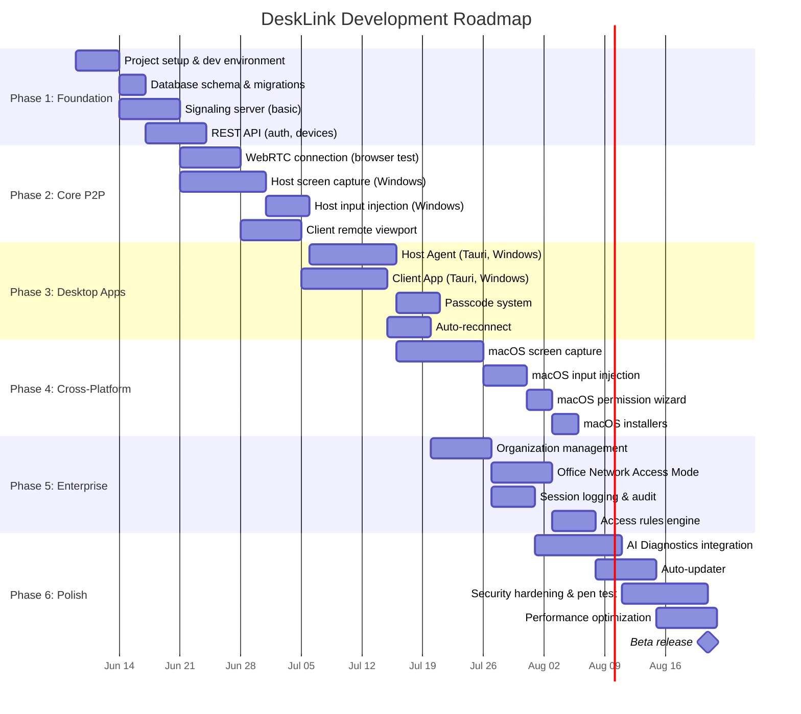

### Phase Details

---

#### Phase 1: Foundation (Weeks 1-3)

| Task | Details | Exit Criteria |
|---|---|---|
| Monorepo setup | npm workspaces, Turborepo, ESLint, Prettier, Rust toolchain | `turbo build` succeeds across all packages |
| Dev environment | Docker Compose with Postgres, Redis, coturn | `docker-compose up` starts full backend locally |
| Database schema | Drizzle ORM, all tables, migrations, seed script | Schema matches ERD; migrations run idempotently |
| Signaling server | WebSocket server, device registration, message routing | Two browser tabs can exchange messages via signaling |
| REST API | Auth (JWT), device CRUD, health check | API tests pass; Swagger docs generated |

---

#### Phase 2: Core P2P (Weeks 3-5)

| Task | Details | Exit Criteria |
|---|---|---|
| WebRTC in browser | Proof-of-concept: two browser tabs establish P2P video | Screen share works tab-to-tab via signaling server |
| Screen capture (Win) | DXGI Desktop Duplication → raw frames → H.264 encode | Captures at 30fps; CPU < 15% on modern hardware |
| Input injection (Win) | `SendInput` for mouse/keyboard; coordinate mapping | Remote clicks land on correct screen position |
| Client viewport | `<canvas>` rendering of decoded video; input capture | Smooth viewport at 720p; mouse/keyboard forwarded |

---

#### Phase 3: Desktop Apps (Weeks 5-8)

| Task | Details | Exit Criteria |
|---|---|---|
| Host Agent (Win) | Tauri app: tray icon, IPC to service, passcode display | Installs via MSI; runs as service; shows in tray |
| Client App (Win) | Tauri app: connection screen, remote viewport, toolbar | Connects to host by Device ID; full remote control |
| Passcode system | Generation, PBKDF2 hashing, rotation, rate-limiting | Passcode verified server-side; brute-force blocked |
| Auto-reconnect | ICE restart → full reconnect → notify user | Survives network switch (Wi-Fi → Ethernet) |

---

#### Phase 4: Cross-Platform (Weeks 8-11)

| Task | Details | Exit Criteria |
|---|---|---|
| macOS capture | ScreenCaptureKit implementation | 30fps capture on Apple Silicon and Intel |
| macOS input | CGEvent posting for mouse/keyboard | Remote control works on macOS host |
| Permission wizard | Guided flow for Accessibility + Screen Recording grants | Non-technical user can grant permissions on first launch |
| Installers | `.dmg` with drag-to-Applications; code-signed + notarized | Clean install on macOS 12.3+; no Gatekeeper warnings |

---

#### Phase 5: Enterprise Features (Weeks 11-15)

| Task | Details | Exit Criteria |
|---|---|---|
| Org management | Create org, invite members, manage devices | Admin can see all org devices and sessions |
| Office Network Mode | Persistent passwords, unattended access, Wake-on-LAN | Connect to office machine without user at host |
| Session logging | Full session lifecycle events; queryable history | Admin can view session history with timeline |
| Access rules | Allow-lists, time windows, approval workflows | Rules enforced; blocked connections logged |

---

#### Phase 6: Polish & Launch (Weeks 15-21)

| Task | Details | Exit Criteria |
|---|---|---|
| AI Diagnostics | LLM-powered analysis of connection failures, quality issues | "Why is my connection slow?" → actionable explanation |
| Auto-updater | Delta patches, Ed25519 verification, rollback | Agent updates without user intervention; rollback on failure |
| Security hardening | Pen test, CSP headers, dependency audit, secret rotation | No critical/high vulnerabilities; SOC 2 readiness |
| Performance | Reduce latency, optimize encoding, memory profiling | < 50ms input-to-screen latency on LAN; < 150ms on WAN |

---

## Open Questions for Your Review

> [!IMPORTANT]
> **1. Naming & Branding:** I used "DeskLink" as a codename. Do you have a preferred product name?

> [!IMPORTANT]
> **2. Initial Platform Priority:** Should we build Windows-first (Phase 2-3) and add macOS later (Phase 4), or develop both in parallel? The roadmap above assumes Windows-first to ship faster.

> [!IMPORTANT]
> **3. Account Model:** The architecture supports both "install-and-go" (no account, just Device ID + passcode) and "account-based" (for org management). Should the MVP require an account, or should accounts be optional?

> [!IMPORTANT]
> **4. AI Diagnostics Scope:** What should the AI analyze? Options:
> - Connection failure root-cause analysis
> - "Why is it slow?" explanations based on quality metrics
> - Proactive suggestions ("Your firewall is blocking UDP, switch to TURN")
> - Natural language session log search
> - All of the above?

> [!IMPORTANT]
> **5. Hosting Preference:** AWS, GCP, Azure, or self-hosted? This affects Terraform modules and TURN server deployment.

> [!IMPORTANT]
> **6. File Transfer:** Should drag-and-drop file transfer between host and client be a Phase 3 feature or deferred to Phase 5?

> [!IMPORTANT]
> **7. Audio Forwarding:** Should remote audio (host's speakers → client's speakers) be included? It's a natural extension of the WebRTC media stack but adds complexity.
